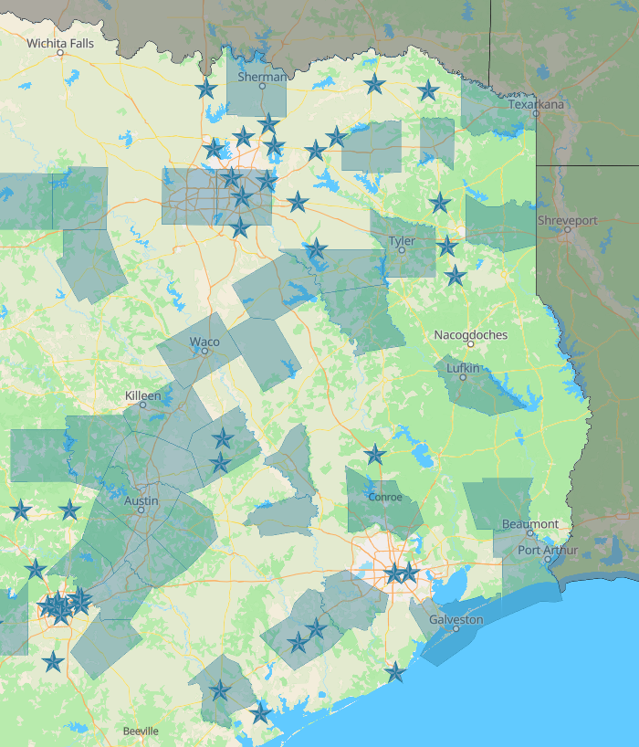

# 💰 TX-PACE: Financing Our Future
**Goal:** To enable major facility upgrades with little to no upfront capital, using long-term energy and water savings to pay for the improvements.

---

## 📈 What is TX-PACE?
**Property Assessed Clean Energy (TX-PACE)** is a proven financial tool established by Texas legislation. It allows property owners—including non-profits and houses of worship—to upgrade aging infrastructure without the burden of a traditional bank loan or a major capital campaign.

* **No Capital Outlay:** Finance 100% of eligible project costs.
* **Cash-Flow Positive:** Projects are structured so that utility savings exceed the assessment payments.
* **Long-Term Funding:** Access private, affordable financing for 20–30 years.
* **Property-Linked:** The assessment is tied to the land, not the individual or the business, meaning the obligation transfers if the property is sold.

---

## 🛑 1. Discovery & Eligibility 
*Foundational steps to determine if TX-PACE is right for your parish.*

### **Jurisdiction Check (Once)**
* **Verify Local Approval:** TX-PACE must be established by your local government. Check the [Texas PACE Authority Map](https://www.texaspaceauthority.org/home) to see if your county or city participates.
* **Asset Assessment:** Identify "permanent" improvements. PACE is designed for equipment and systems intended to decrease water or energy consumption or increase building resiliency.

---

## ⚠️ 2. Strategic Retrofits 
*High-impact systems that qualify for PACE financing.*

### **Mechanical & Energy Upgrades (Once)**
* **HVAC & Controls:** Replace aging chillers, boilers, and furnaces. Include modern Building Management Systems (BMS) or Energy Management Systems (EMS).
* **Building Envelope:** Finance high-efficiency roofing, windows, doors, and industrial-grade insulation.
* **Lighting & Power:** Comprehensive LED retrofits and elevator modernization.

### **Water Conservation (Once)**
* **Infrastructure:** High-efficiency toilets, faucets, and greywater recycling systems.
* **Irrigation:** Commercial-grade irrigation equipment and large-scale rainwater collection systems.

---

## ✨ 3. Advanced Resilience 
*Transformational projects that secure the parish's long-term environmental mission.*

### **Distributed Generation**
* **Renewable Energy:** Install large-scale solar arrays or wind turbines. 
* **Heat Recovery:** Implement advanced heat recovery systems and steam traps to maximize thermal efficiency.

### **Strategic Planning (Annually)**
* **Portfolio Review:** If the parish manages multiple buildings or a school, use TX-PACE to standardize efficiency across the entire campus. 
* **Financial Alignment:** Work with the vestry to align PACE assessments with the church’s 10-year capital maintenance plan.

---

## 📊 Typical PACE-Eligible Improvements
| Energy Efficiency | Water Conservation | Distributed Generation |
| :--- | :--- | :--- |
| Chillers & Boilers | Toilets & Faucets | Solar Panels |
| HVAC Controls (BMS) | Irrigation Systems | Wind Turbines |
| Lighting & Windows | Rainwater Collection | Heat Recovery |
| Roofing & Insulation | Greywater Systems | Steam Traps |

---

### **Resource Links**
* [**Texas PACE Authority**](https://www.texaspaceauthority.org/home)
* [**Case Studies: Non-Profit Success Stories**](https://www.texaspaceauthority.org/case-studies)

###  **Where is PACE available?**

The highlighted counties, and the starred cities have active PACE programs.

{width=50% fig-align="left"}

