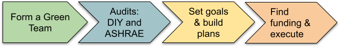

# The Process: Getting Started
**Goal:** To provide a clear, iterative framework for congregations to begin their journey toward environmental stewardship and climate resilience.

---

## Where Do We Begin?
Transitioning toward a resilient and sustainable campus is a multidimensional effort. While the path is not always linear, following a structured process helps ensure that your efforts are both effective and sustainable over the long term.

---

## 1. Starting point 
*Essential first steps to build the foundation for your parish’s work.*

### **Assemble the Team (Once)**
* **Form a Dedicated Group:** Someone must take the lead to move things forward. Establish a "Green Team," "Environmental Guild," or "Creation Care Team". 
* **Diverse Representation:** Seek members with various skills—from facilities management and finance to spiritual formation and community outreach.

## 2. **Initial Discovery (Once)**
* **Conduct Audits:** Before making changes, you must understand your current baseline. Use the resources in our **Auditing** section for both DIY assessments and professional surveys.

## 3. Goal setting and planning 
*Measures to turn data into a strategic plan and tackle immediate wins.*

### **Strategic Planning (Annually)**
* **Set Clear Goals:** Use your audit data to establish measurable targets. Examples include:
    * Reducing the carbon footprint by 50%.
    * Cutting water usage by 50%.
    * Saving a specific dollar amount on utilities.
* **Identify "Low-Hanging Fruit":** Start by attacking the easiest, most cost-effective items first. These quick wins build momentum and provide immediate savings that can be reinvested.

---

## 4. Execution 
*Advanced strategies for long-term execution and continuous improvement.*

### **Execution & Funding (Ongoing)**
* **Secure Financing:** Develop a plan to fund larger upgrades. This may involve capital campaigns, diocesan grants, or innovative tools like **TX-PACE**.
* **Execute the Plan:** Move beyond the easy fixes to address more difficult or capital-intensive resilience projects.

### **Iterative Growth (Annually)**
* **Review & Iterate:** This is not a one-time project, but a continuous cycle of improvement. Regularly revisit your audits and goals to measure progress and adjust your plans for the next phase of growth.

---

## The Resilience Lifecycle
| Phase | Focus | Key Deliverable |
| :--- | :--- | :--- |
| **Phase 1: Foundation** | Team & Audits | Current Baseline Report |
| **Phase 2: Strategy** | Goals & Quick Wins | Strategic Action Plan |
| **Phase 3: Transformation** | Funding & Execution | Completed Capital Upgrades |
| **Phase 4: Review** | Iteration | Updated Goals for Next Year |

---

### **Resource Links**
* [**Energy Audit:**](energy-audit.html) 
  Perform a professional energy audit to identify where heat
  is escaping and where electrical loads can be reduced. 
  
* [**Water Audit:**](water-audit.html) Conduct a full water audit to find hidden leaks and inefficient fixtures.

* [**Waste Audit:**](waste-audit.html) Identify opportunities to reduce landfill waste through
  composting, recycling, and eliminating single-use plastics. 

* [**Financing Resilience**](Financing.qmd): Information on funding strategies.
